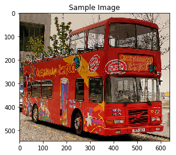

# Image Captioning

## Project overview

The aim of this project is to build a model able to produce image captions stating from images. The model architecture is designed as encoder-decoder. The encoder part is resnet50 pretrained. The resnet50 is used to create the feature vector that later will be feed inside the decoder. The decoder part of the model is a RNN and specifically, a LSTM, chosen to ensure the best performances in the presence of long caption.

<div style="text-align:center"></div>

The mentioned model is then trained on Microsoft COCO, where images are annotated by humans. The output of the model is the creation of a caption for a specific image, like in the picture below.

<div style="text-align:center"></div>
<center>A red and white bus parked next to a building.</center>

<n></n>
This project is required as part of the program: Udacity Computer Vision Nanodegree. It is here presented with some improvements.


## Project notebook setup

The project is divided into four main Python notebooks that will perform:

__0.Dataset.ipynb__ : This first notebook setup the COCO API

__1.Preliminaries.ipynb__ : Create the required vocabulary by preprocessing the COCO dataset

__2.Training__ : Notebook to perform train of the CNN-RNN model

__3.Inference__ : Notebook to use the trained model to generate captions for images in the test dataset

Additionally, to the notebooks above, there three files, three Python script file (.py):

__model.py__ :  Define the convolutional neural network and LSTM architecture alongside the function forward.

__data_load.py__ :  Helper function to perform data loading

__vocabulary.py__ : Script to implement the Vocabulary class


## Data

The Microsoft Common Objects in COntext (MS COCO) dataset is a large-scale dataset for scene understanding. The dataset is commonly used to train and benchmark object detection, segmentation, and captioning algorithms. More information about the COCO dataset on the [official website](http://cocodataset.org/#home)

**NOTE: The following steps are needed to initialize the COCO API. These steps are needed to start using the API called inside the notebooks**


1. Clone this repo: https://github.com/cocodataset/cocoapi  
```
git clone https://github.com/cocodataset/cocoapi.git  
```

2. Setup the coco API (also described in the readme [here](https://github.com/cocodataset/cocoapi))
```
cd cocoapi/PythonAPI  
make  
cd ..
```

3. Download some specific data from here: http://cocodataset.org/#download (described below)

* Under **Annotations**, download:
  * **2014 Train/Val annotations [241MB]** (extract captions_train2014.json and captions_val2014.json, and place at locations cocoapi/annotations/captions_train2014.json and cocoapi/annotations/captions_val2014.json, respectively)  
  * **2014 Testing Image info [1MB]** (extract image_info_test2014.json and place at location cocoapi/annotations/image_info_test2014.json)

* Under **Images**, download:
  * **2014 Train images [83K/13GB]** (extract the train2014 folder and place at location cocoapi/images/train2014/)
  * **2014 Val images [41K/6GB]** (extract the val2014 folder and place at location cocoapi/images/val2014/)
  * **2014 Test images [41K/6GB]** (extract the test2014 folder and place at location cocoapi/images/test2014/)

## Possible improvements

- Use the validation set to guide the search of hyperparameters
- Use a bigger CNN encoder
- Train the model longer
- Implement more complex models like [Oscar: Object-Semantics Aligned Pre-training for Vision-and-Language Tasks](https://github.com/microsoft/Oscar)

LICENSE: This project is licensed under the terms of the MIT license.
